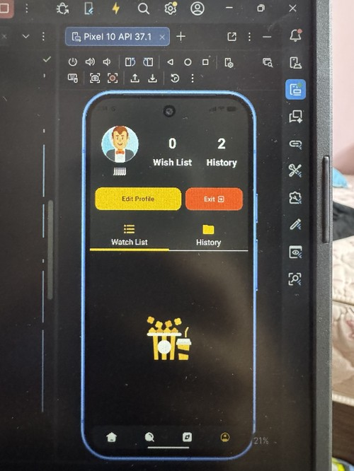
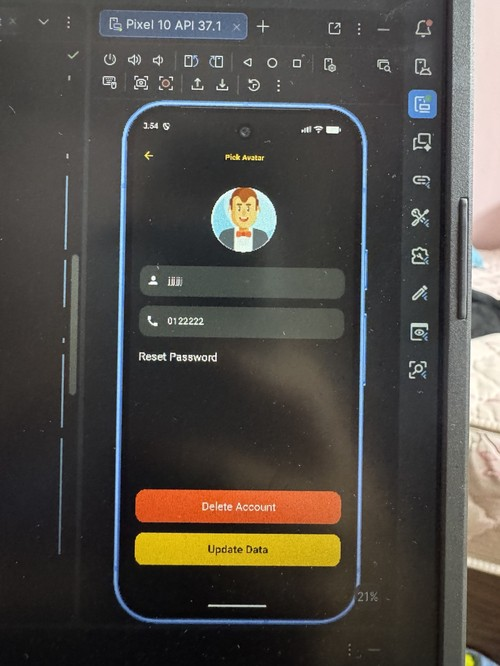
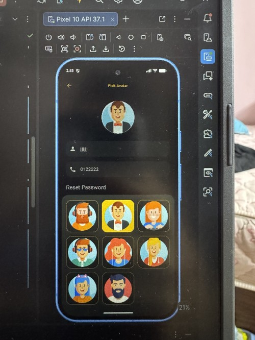
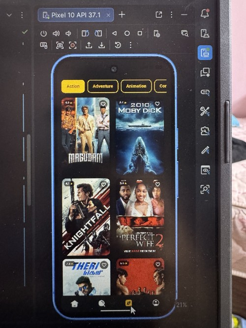
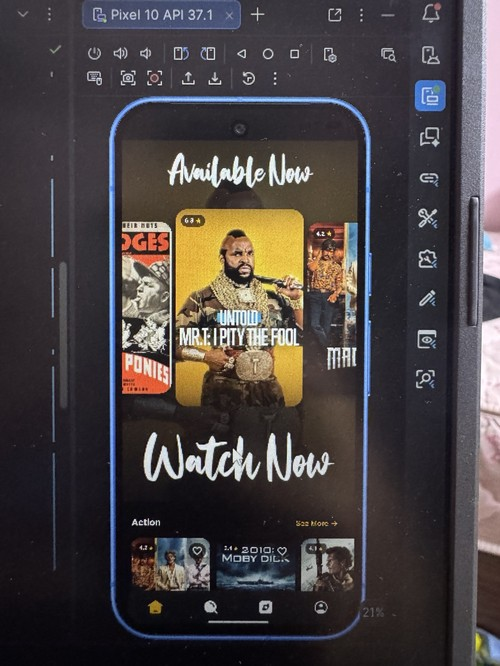
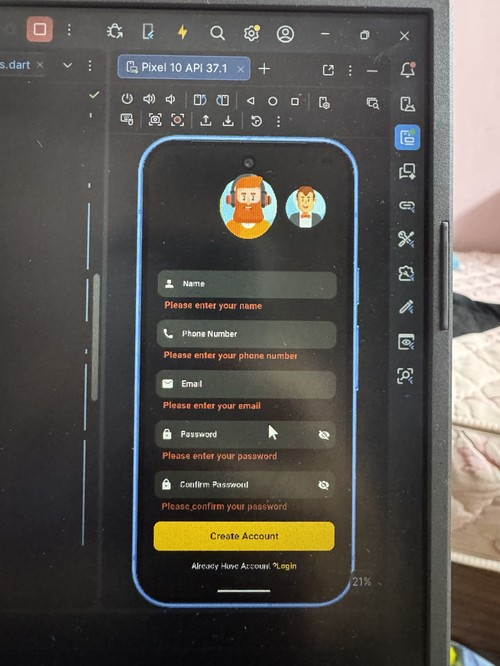
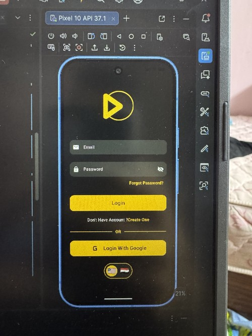

# 🎬 Movies App

A modern Flutter Movies Application built with Firebase and REST APIs.

The app allows users to browse movies, search for movies, explore movies by genre, view movie details, save favorite movies, track watch history, and manage their profile.

## 🚀 Features

- Splash Screen
- Onboarding Screens
- User Registration
- User Login
- Google Sign-In
- Forgot Password
- Firebase Authentication
- Movie Browsing
- Movie Search
- Browse Movies by Genre
- Movie Details
- Favorite Movies / Watch List
- Watch History
- User Profile
- Update Profile
- Delete Account
- Logout
- Arabic & English Localization
- Responsive UI

## 🛠 Technologies Used

- Flutter
- Dart
- Firebase Authentication
- Cloud Firestore
- REST APIs
- Dio
- BLoC / Cubit
- Flutter ScreenUtil
- Localization
- Git & GitHub

## 📱 Main Screens

- Splash
- Onboarding
- Login
- Register
- Home
- Search
- Explore
- Movie Details
- Watch List
- History
- Profile
- Update Profile

## 📸 Screenshots

  
  
  

  
  
  

  

## 🔥 Firebase

Firebase is used for:

- User Authentication
- Google Sign-In
- User profile data
- Favorite movies
- Watch history
- Cloud Firestore storage

## 🎥 Movie API

Movie data is retrieved from the YTS Movies API.

The API is used to display:

- Movie titles
- Posters
- Ratings
- Genres
- Release dates
- Movie details

## 👨‍💻 My Contribution

This is a team project, and I worked on multiple parts of the application, including:

- Firebase Authentication
- Google Sign-In
- Forgot Password
- Profile Management
- Favorites / Watch List
- Watch History
- Movie Details
- Explore Screen
- Localization
- Git & GitHub integration

## 📌 Project Status

The project is currently under development.

## 👤 Developer

**Omar Sabry**  
Flutter Developer

### Skills

Flutter • Dart • Firebase • REST APIs • Git & GitHub
